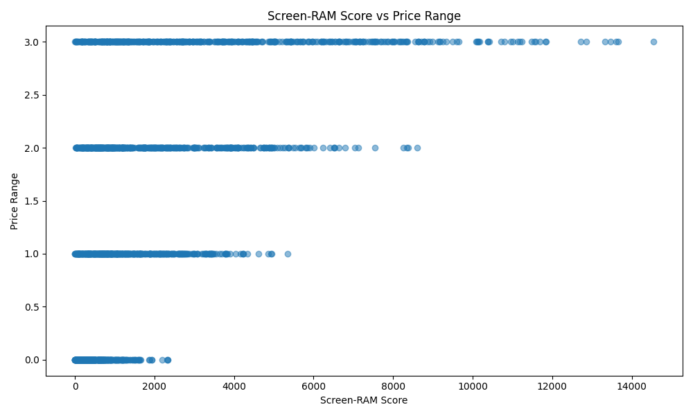

# Описание проекта
Необходимо разработать модель классификации, которая на основе различных характеристик мобильного телефона сможет предсказать его ценовой диапазон (price_range).

Целевой переменной является price_range, которая принимает значения от 0 до 3, где:
• 0: бюджетные телефоны
• 1: телефоны низко-среднего сегмента
• 2: телефоны среднего и высокого сегмента
• 3: премиум телефоны

## Результаты разведочного анализа (EDA)

### Действия по очистке данных:
1. Удалены записи с нулевыми значениями в полях:
   - sc_w (ширина экрана)
   - pc (основная камера)
   - fc (фронтальная камера)
   - px_height (высота в пикселях)
2. Оптимизированы типы данных для всех столбцов
3. Проверено отсутствие дубликатов
4. Проверено отсутствие пропущенных значений

### Основные выводы:
1. [Распределение мощности батареи](./eda/battery_distribution.png):
   - Наблюдается равномерное распределение
   - Отсутствуют явные выбросы

2. [RAM vs Ценовой диапазон](./eda/ram_price_scatter.png):
   - Выявлена сильная положительная корреляция
   - Чем больше RAM, тем выше ценовой диапазон
   - Четкое разделение ценовых категорий

3. [Разрешение экрана](./eda/resolution.png):
   - Линейная зависимость между высотой и шириной
   - Стандартное соотношение сторон у большинства устройств

4. [Матрица корреляций](./eda/correlation_matrix.png):
   - Наибольшая корреляция с ценой у RAM (0.92)
   - Умеренная корреляция у battery_power (0.22)
   - Слабые корреляции между остальными признаками

5. [Интерактивный график RAM vs Батарея](./eda/interactive_plot.html):
   - Подтверждает важность RAM для определения цены
   - Показывает кластеризацию устройств по ценовым категориям

### Синтетические признаки

#### Screen RAM Score


#### Описание признака
- Объединяет разрешение экрана (px_height × px_width) и объем RAM

#### Результаты анализа
1. Корреляция с ценой: {correlation:.3f}
   - Показывает сильную положительную корреляцию
   - Подтверждает важность как качества экрана, так и объема RAM

2. Распределение по ценовым диапазонам:
   - Четкое разделение между ценовыми категориями
   - Более высокие значения score соответствуют более дорогим моделям

3. Практическая значимость:
   - Может использоваться как надежный предиктор цены
   - Отражает общий технологический уровень устройства

### Значимые закономерности для модели:
1. RAM является ключевым фактором для определения ценового диапазона
2. Мощность батареи имеет умеренное влияние на цену
3. Разрешение экрана менее значимо для определения цены
4. Датасет хорошо сбалансирован по ценовым категориям

## Запуск проекта
```bash
git clone https://github.com/DashinIN/ISS_Labs.git
cd IIS-Labs
python -m venv .venv
.venv/Scripts/activate
pip install -r requirements.txt
```

## Структура проекта
- `data/` - исходные и очищенные данные
- `eda/` - графики и результаты анализа
- `requirements.txt` - зависимости проекта